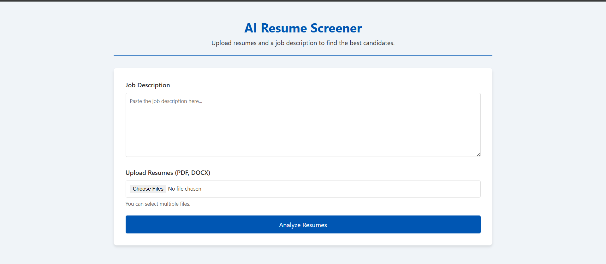
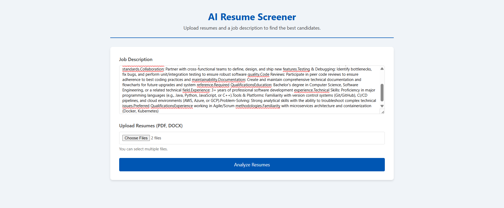
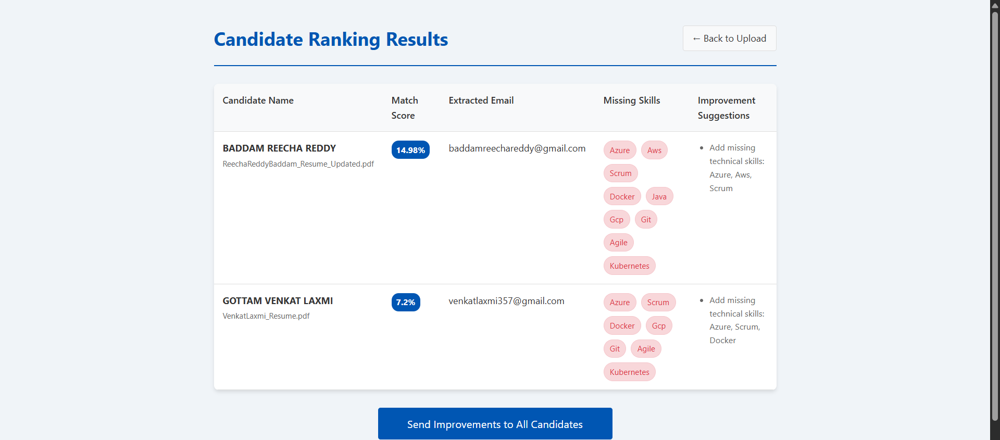

# 🚀 SmartHire-AI

An AI-powered Resume Screening and Enhancement System that analyzes resumes, extracts key information, and provides smart suggestions to improve candidate profiles.

---

## 📌 Features

- 🔍 **Resume Parsing** – Extracts email, skills, and key details from resumes
- 🤖 **AI Skill Matching** – Matches candidate skills with job requirements
- 📊 **Smart Suggestions** – Provides improvements for better resume quality
- 📧 **Email Integration** – Sends feedback directly to applicants
- 🌐 **User-Friendly Interface** – Simple and interactive UI

---

## 🛠️ Tech Stack

- **Frontend:** HTML, CSS, JavaScript
- **Backend:** Python (Flask)
- **AI/NLP:** SpaCy
- **Database:** CSV / JSON
- **Tools:** Git, GitHub, VS Code

---

## 📂 Project Structure

```
AI_Resume_Screener/
│── app.py
│── skill_extractor.py
│── requirements.txt
│── README.md
│── static/
│── templates/
│── data/
```

---

## ⚙️ Installation & Setup

1. Clone the repository:

```
git clone https://github.com/VenkatLaxmi-code/ResumeBoost-AI.git
```

2. Navigate to project folder:

```
cd AI_RESUME_SCREENER 
```

3. Install dependencies:

```
pip install -r requirements.txt
```

4. Run the application:

```
python app.py
```

---

## 🚀 Usage

- Upload a JD
- Upload a resume
- System extracts skills & details
- AI analyzes and gives suggestions
- Option to send feedback via email

---

## 🎯 Future Improvements

- 🔗 Job portal integration
- 📈 Advanced AI scoring system
- 🌍 Multi-language support
- 📊 Dashboard analytics

---

## 🤝 Contributing

Contributions are welcome! Feel free to fork this repo and submit a pull request.

---

## 🙌 Acknowledgements

- SpaCy NLP Library
- Open-source community

---

## 📸 Screenshots

<h3>📄 Resume & JD Upload Interface</h3>
<p align="center">
  
</p>

<h3>🤖 Uploaded Resume and JD </h3>
<p align="center">
  
</p>

<h3>📊 AI-Powered Suggestions , Results & Feeback to Candidate email</h3>
<p align="center">
  
</p>


## 👨‍💻 Author

Venkat Laxmi Gottam

⭐ If you like this project, don’t forget to star the repo!
